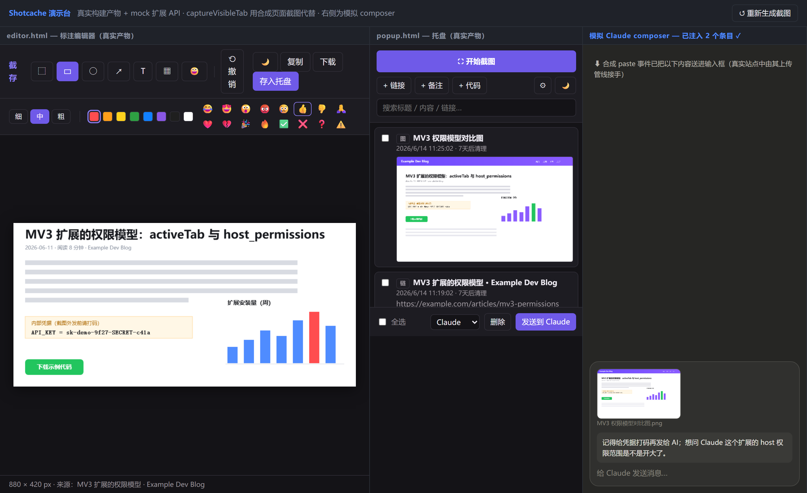
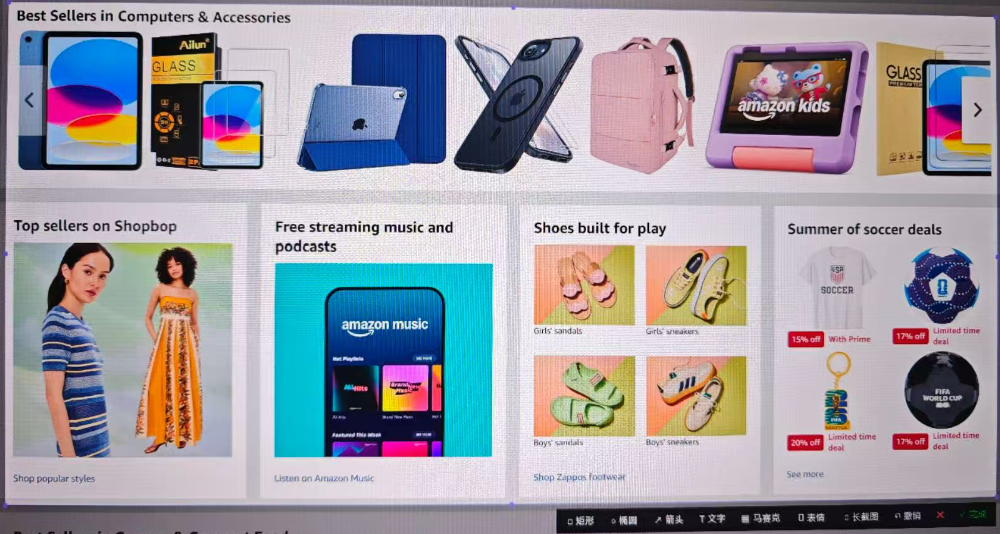
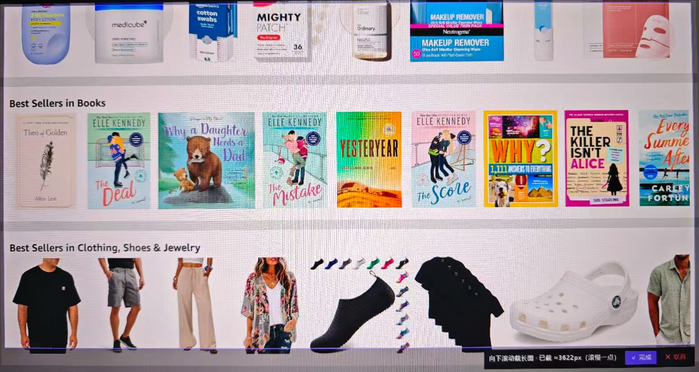
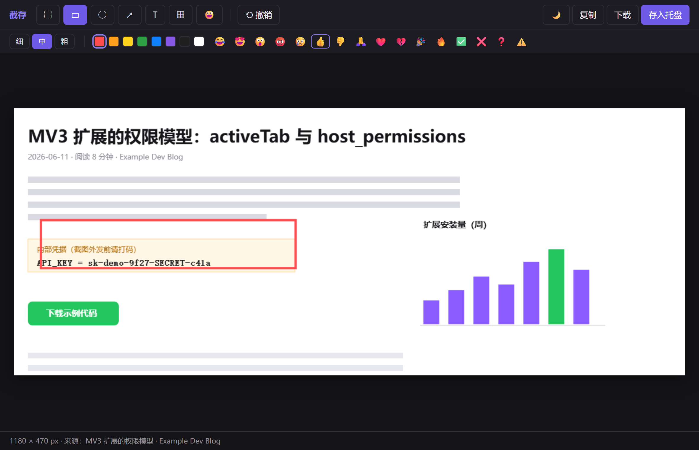
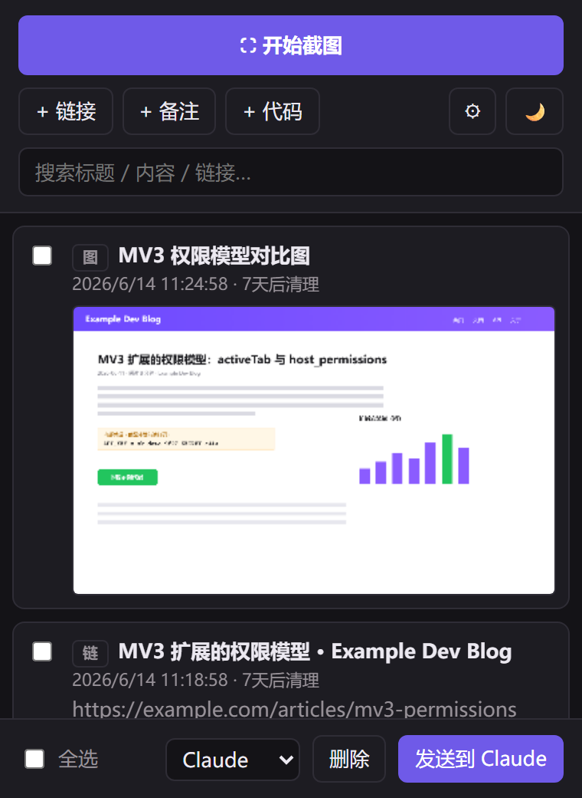
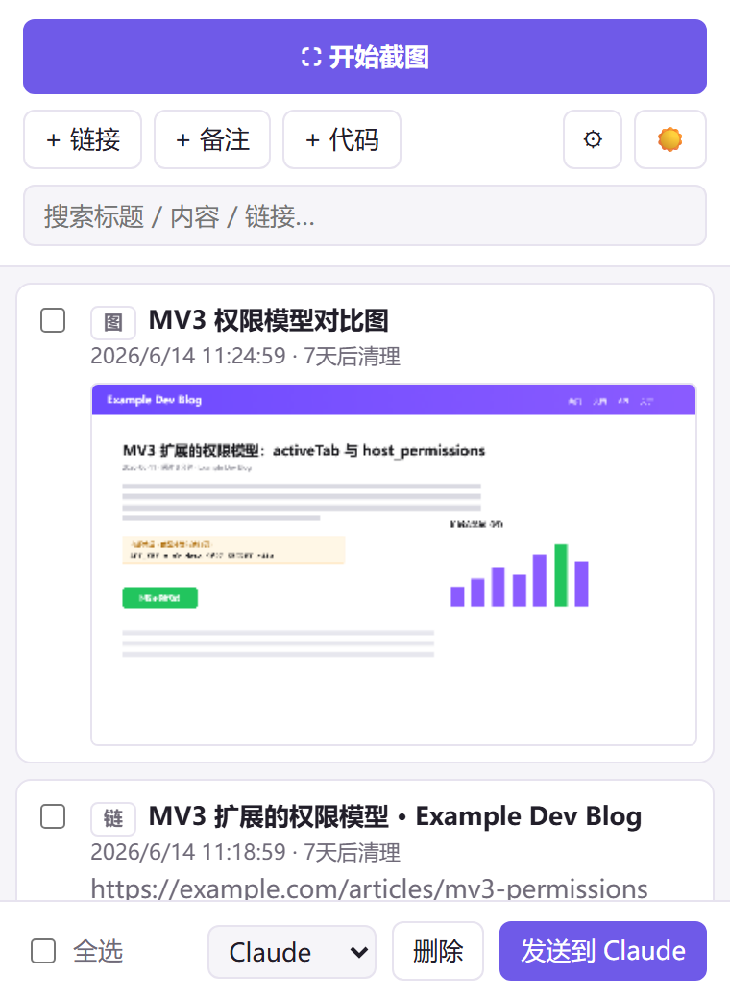

# Shotcache（截存）

[English](README.en.md) · **简体中文**

微信级截图体验 + 暂存托盘 + 一键发给 AI 的 Chrome 扩展。由 Chrome 扩展
（WXT + TypeScript + MV3）和一个 Windows 伴生程序（C#，本机编译，仓库零二进制）
组成：任意应用里按 `Ctrl+Alt+A` 就能在屏幕上框选、标注、滚动长截图，截完同时
进剪贴板和托盘，托盘里攒下的素材可以勾选后一键注入 **Claude / ChatGPT / Gemini**
的输入框。

<p align="center">
  
</p>
<p align="center"><em>截图标注 → 存进托盘 → 勾选条目 → 一键注入 AI 输入框。</em></p>
<br>
<p align="center">
  
</p>
<p align="center"><em>截图工具栏</em></p>
<br>
<p align="center">
  
</p>
<p align="center"><em>长截图工具栏</em></p>

> **平台**：Windows。扩展本体跨平台，但「微信级截图」体验依赖 Windows 伴生程序；
> macOS / Linux 上扩展仍可用（走下文的浏览器降级流程）。

## 解决什么问题

给 AI 喂截图的真实工作流很碎：截一张 → 切到聊天页 → 粘贴 → 再切回来截下一张……
素材散落在剪贴板和下载目录里，剪贴板永远只装得下最后一张，聊天页一关就没了。

微信截图（Alt+W）的体验是公认的好——热键秒出、屏上直接框选、标完回车就走——
但它不留记录，截过的图不会攒下来等你批量使用。而 Chrome 纯扩展又做不出这种
体验：平台规则强制弹"选择屏幕"确认框，框选只能在网页里做，热键出不了浏览器。

Shotcache 把截图前端做进桌面伴生程序拿回微信级体验，把存储和注入留在扩展里
服务 AI 工作流——两边各干各擅长的事。

## 功能特性

- **微信级截图，且截完有记录**：`Ctrl+Alt+A` → 覆盖层 1:1 框选（可拖边角微调）
  → 选区旁工具条标注 → 回车收工，零弹窗、零标签页、焦点回到原应用；同时静默
  存入托盘，7 天内随时取用。
- **双收尾**：每张截图同时进剪贴板（立即可贴，DIB+PNG 双格式）和托盘（攒着批量发）。
- **完整标注**：矩形 / 椭圆 / 箭头 / 文字 / 马赛克 / 表情，8 色调色板 + 三档粗细。
  浏览器编辑器还支持「选择」工具——选中已画的标注再拖动 / 删除 / 改色改粗细 / 双击改字。
- **滚动长截图**：覆盖层「⇳ 长截图」框选后，由你手动向下滚动、边滚边拼接（图像
  匹配自动去重，吸顶/吸底栏只保留一次）；点「完成」后在编辑器里标注，再存托盘。
- **为 AI 工作流而生**：托盘里勾选若干条目（截图 / 链接 / 备注 / 代码）→ 一键注入
  AI 聊天输入框，代码自动包成 Markdown 代码块，复用站点自身的粘贴上传管线。
- **暗色 / 亮色双主题**：扩展页面（托盘 / 编辑器）配色为「墨黑 + 雾紫」，默认跟随
  系统，点 🌗 一键切换深浅且记忆选择；原生覆盖层始终深色 + 紫色强调（浮在任意
  画面上对比最稳），双端紫色同源、视觉一致。
- **可审计、低权限**：伴生程序由 Windows 自带 csc.exe 本机编译（仓库不含任何
  二进制），注册表只写 HKCU，无管理员权限、无开机自启（随 Chrome 启停）；扩展
  权限极小（无 `<all_urls>`、无 `activeTab`/`scripting`，仅三个发送站点的 host
  权限）。不装伴生组件也能用，全屏截图自动降级到 Chrome 屏幕选择器，功能不中断。

<p align="center">
  
</p>
<p align="center"><em>标注编辑器：工具条、8 色调色板、彩色表情、三档粗细，以及选择工具。</em></p>

## 安装

```bash
npm install && npm run build      # 产物在 .output/chrome-mv3/
```

`chrome://extensions` → 开发者模式 → 加载已解压的扩展程序 → 选 `.output/chrome-mv3`，
然后安装伴生组件（给你微信级截图体验）：

```powershell
# 复制扩展 ID（chrome://extensions 卡片上的 32 位小写字母），在仓库根目录执行：
powershell -ExecutionPolicy Bypass -File native-host\install.ps1 -ExtensionId <扩展ID>
# 重新加载扩展即可，无需重启 Chrome。卸载：uninstall.ps1
```

## 使用

| 入口 | 作用 |
|---|---|
| `Ctrl+Alt+A`（全局，任意应用） | 覆盖层框选 → 标注 → 回车 = 复制 + 入托盘 |
| 覆盖层工具条「⇳ 长截图」 | 框选后手动向下滚动、边滚边拼接，点「完成」→ 在编辑器里标注后存托盘 /「取消」放弃（任意应用） |
| popup「⛶ 开始截图」/ `Alt+Shift+F` | 同覆盖层（从 Chrome 内触发） |
| popup「⚙ 设置」 | 自定义全局热键（录制组合键）；Chrome 命令快捷键给跳转入口 |
| popup「+链接 / +备注 / +代码」 | 非图片素材入托盘 |
| popup / 编辑器「🌗」 | 深色 / 浅色主题切换（默认跟随系统，记忆选择） |

覆盖层快捷键：`Ctrl+Z` 撤销、`Esc` 取消、右键清空选区重选、双击或回车完成。
托盘（点扩展图标打开）：搜索、看原图、勾选 → 选目标 → 发送；条目 7 天自动清理
（`shared/config.ts` 可调）。扩展快捷键可在 `chrome://extensions/shortcuts` 修改。

几个边界值得知道：全局热键仅 Chrome 运行期间有效（被占用时 popup 顶部有提示）；
覆盖层长截图靠你手动向下滚动驱动（滚太快会丢内容，慢一点更稳），选区内有动画
可能拼接失败；不装伴生组件时全屏截图降级到 Chrome 屏幕选择器（每次会弹一次确认框）。

<p align="center">
  
  &nbsp;&nbsp;
  
</p>
<p align="center"><em>暂存托盘 —— 深色（默认）与浅色双主题。</em></p>

## 开发

```bash
npm run compile      # tsc --noEmit
npm run build        # wxt build
npm run zip          # 可上传商店的 zip
npm run dev          # HMR（content script 改动需手动刷新页面）
```

host 自测（不依赖 Chrome）：`powershell -ExecutionPolicy Bypass -File
native-host\test-host.ps1`，期待 `PASS v2: ...`（协议）与 `STITCH PASS: ...`
（长截图拼接合成帧回归）两行。

## 许可

LGPL-2.1（见 [LICENSE](LICENSE)）。
